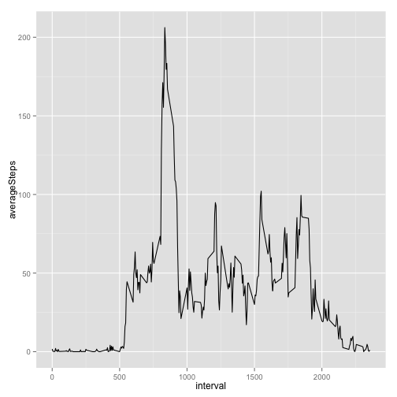

# Reproducible Research: Peer Assessment 1


```r
rm(list = ls())  # clean up environment to reduce side effects
library(lubridate)
library(data.table)
```

```
## 
## Attaching package: 'data.table'
## 
## The following objects are masked from 'package:lubridate':
## 
##     hour, mday, month, quarter, wday, week, yday, year
```

```r
library(ggplot2)
```


## Loading and preprocessing the data

```r
zipfile <- "activity.zip"
activityFileName <- "activity.csv"

activities <- read.csv(unz(zipfile, activityFileName))
activities$date <- ymd(activities$date)

convertIntervalToHourMinutes <- function(interval) {
    hoursOnly <- interval%/%100
    minutesOnly <- interval - (hoursOnly * 100)
    
    return(hm(paste(hoursOnly, minutesOnly, sep = ":")))
}

dateTimeInterval <- activities$date + convertIntervalToHourMinutes(activities$interval)
activities <- cbind(activities, dateTimeInterval)
summary(activities)
```

```
##      steps            date               interval   
##  Min.   :  0.0   Min.   :2012-10-01   Min.   :   0  
##  1st Qu.:  0.0   1st Qu.:2012-10-16   1st Qu.: 589  
##  Median :  0.0   Median :2012-10-31   Median :1178  
##  Mean   : 37.4   Mean   :2012-10-31   Mean   :1178  
##  3rd Qu.: 12.0   3rd Qu.:2012-11-15   3rd Qu.:1766  
##  Max.   :806.0   Max.   :2012-11-30   Max.   :2355  
##  NA's   :2304                                       
##  dateTimeInterval             
##  Min.   :2012-10-01 00:00:00  
##  1st Qu.:2012-10-16 05:58:45  
##  Median :2012-10-31 11:57:30  
##  Mean   :2012-10-31 11:57:30  
##  3rd Qu.:2012-11-15 17:56:15  
##  Max.   :2012-11-30 23:55:00  
## 
```

```r

activities.dt <- as.data.table(activities)
```


## What is mean total number of steps taken per day?

```r

totalStepsPerDay <- activities.dt[!is.na(steps), list(totalSteps = sum(steps)), 
    by = date]
summary(totalStepsPerDay)
```

```
##       date                       totalSteps   
##  Min.   :2012-10-02 00:00:00   Min.   :   41  
##  1st Qu.:2012-10-16 00:00:00   1st Qu.: 8841  
##  Median :2012-10-29 00:00:00   Median :10765  
##  Mean   :2012-10-30 17:12:27   Mean   :10766  
##  3rd Qu.:2012-11-16 00:00:00   3rd Qu.:13294  
##  Max.   :2012-11-29 00:00:00   Max.   :21194
```

```r

# TODO: add title and proper axis titles maybe convert totals to table?
# hist(totalStepsPerDay[,totalSteps], breaks='FD')
breaks <- pretty(range(totalStepsPerDay[, totalSteps], na.rm = TRUE), n = nclass.FD(totalStepsPerDay[, 
    totalSteps]), min.n = 1)
g <- ggplot(totalStepsPerDay, aes(x = totalSteps))
g <- g + geom_histogram(breaks = breaks)
g + geom_rug()
```

 

```r

# mean and median total steps per day
totalStepsPerDay[, list(mean = mean(totalSteps), median = median(totalSteps))]
```

```
##     mean median
## 1: 10766  10765
```


## What is the average daily activity pattern?


```r

averageStepsPerInterval <- activities.dt[!is.na(steps), list(averageSteps = mean(steps)), 
    by = interval]
with(averageStepsPerInterval, plot(interval, averageSteps, type = "l"))
```

 

```r

g <- ggplot(averageStepsPerInterval, aes(interval, averageSteps))
g + geom_line()
```

 

```r


# interval with the maximum average number of steps
maxAverageNumberOfSteps <- max(averageStepsPerInterval[, averageSteps])
averageStepsPerInterval[averageSteps == maxAverageNumberOfSteps, interval]
```

```
## [1] 835
```


## Imputing missing values


## Are there differences in activity patterns between weekdays and weekends?
