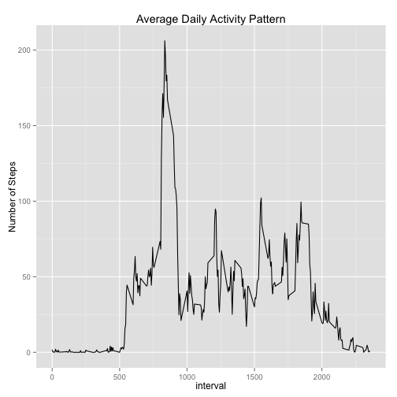
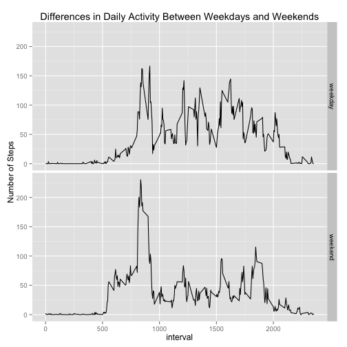

# Reproducible Research: Peer Assessment 1

Project information can be found in the README.md in the same directory as this file.


```r
opts_chunk$set(echo = TRUE)  # technically not necessary since the default is TRUE
```


Let's initialize with the packages required for the analysis

```r
rm(list = ls())  # clean up environment when not using knitr to reduce side effects
library(ggplot2)
library(lubridate)
library(data.table)
```

```
## 
## Attaching package: 'data.table'
## 
## The following objects are masked from 'package:lubridate':
## 
##     hour, mday, month, quarter, wday, week, yday, year
```


## Loading and preprocessing the data
#### Download activity.zip file if not in data folder. 

```r
fileUrl <- "https://d396qusza40orc.cloudfront.net/repdata%2Fdata%2Factivity.zip"
zipfile <- "data//activity.zip"
activityFileName <- "activity.csv"
if (!file.exists("data")) {
    dir.create("data")
}
if (!file.exists(zipfile)) {
    download.file(fileUrl, zipfile, method = "curl")
}
```


#### Read activity file and prepare for analysis

```r
activities <- read.csv(unz(zipfile, activityFileName))
activities$date <- ymd(activities$date)  # reclassify factor as date

activities.dt <- as.data.table(activities)
```


#### Overview of the data.table we just read:

```r
dim(activities.dt)
```

```
## [1] 17568     3
```

```r
summary(activities.dt)
```

```
##      steps            date               interval   
##  Min.   :  0.0   Min.   :2012-10-01   Min.   :   0  
##  1st Qu.:  0.0   1st Qu.:2012-10-16   1st Qu.: 589  
##  Median :  0.0   Median :2012-10-31   Median :1178  
##  Mean   : 37.4   Mean   :2012-10-31   Mean   :1178  
##  3rd Qu.: 12.0   3rd Qu.:2012-11-15   3rd Qu.:1766  
##  Max.   :806.0   Max.   :2012-11-30   Max.   :2355  
##  NA's   :2304
```

```r
head(activities.dt)
```

```
##    steps       date interval
## 1:    NA 2012-10-01        0
## 2:    NA 2012-10-01        5
## 3:    NA 2012-10-01       10
## 4:    NA 2012-10-01       15
## 5:    NA 2012-10-01       20
## 6:    NA 2012-10-01       25
```


## What is mean total number of steps taken per day?

#### Calculate the total number of steps per day.

```r
totalStepsPerDay <- activities.dt[, list(totalSteps = sum(steps, na.rm = TRUE)), 
    by = date]
summary(totalStepsPerDay)
```

```
##       date              totalSteps   
##  Min.   :2012-10-01   Min.   :    0  
##  1st Qu.:2012-10-16   1st Qu.: 6778  
##  Median :2012-10-31   Median :10395  
##  Mean   :2012-10-31   Mean   : 9354  
##  3rd Qu.:2012-11-15   3rd Qu.:12811  
##  Max.   :2012-11-30   Max.   :21194
```

```r

g <- ggplot(totalStepsPerDay, aes(x = totalSteps))
g <- g + geom_histogram(binwidth = 2000, color = "lightgray")
g <- g + labs(title = "Histogram Of The Total Number Of Steps Per Day")
g <- g + labs(x = "Total Number Of Steps Per Day")
g + geom_rug()
```

 


#### Mean and median total steps per day

```r
totalStepsPerDay[, list(mean = mean(totalSteps), median = median(totalSteps))]
```

```
##    mean median
## 1: 9354  10395
```


## What is the average daily activity pattern?
#### Look at the data summarized at the interval level

```r
avgStepsPerInterval <- activities.dt[, list(averageSteps = mean(steps, na.rm = TRUE)), 
    by = interval]
head(avgStepsPerInterval)
```

```
##    interval averageSteps
## 1:        0      1.71698
## 2:        5      0.33962
## 3:       10      0.13208
## 4:       15      0.15094
## 5:       20      0.07547
## 6:       25      2.09434
```


```r
g <- ggplot(avgStepsPerInterval, aes(interval, averageSteps))
g <- g + geom_line()
g + labs(title = "Average Daily Activity Pattern", y = "Number of Steps")
```

 


#### We can now find the interval with the maximum average number of steps

```r
maxAverageNumberOfSteps <- max(avgStepsPerInterval$averageSteps)
result <- avgStepsPerInterval[averageSteps == maxAverageNumberOfSteps, interval]
```


The interval with the biggest average number of step is **835**

## Imputing missing values
The number of missing steps in the dataset is : **2304**

### Filling missing values
**Strategy being used:**
* Take the previously calculated mean number of steps for a given interval to replace the missing values.


```r
nomissing.dt <- activities.dt
nomissing.dt[is.na(steps), `:=`(steps, as.integer(avgStepsPerInterval[avgStepsPerInterval$interval == 
    interval, averageSteps]))]
```

```
##        steps       date interval
##     1:     1 2012-10-01        0
##     2:     0 2012-10-01        5
##     3:     0 2012-10-01       10
##     4:     0 2012-10-01       15
##     5:     0 2012-10-01       20
##    ---                          
## 17564:     4 2012-11-30     2335
## 17565:     3 2012-11-30     2340
## 17566:     0 2012-11-30     2345
## 17567:     0 2012-11-30     2350
## 17568:     1 2012-11-30     2355
```


#### Let's now create the same histogram from above with the missing values filled.

```r
totalStepsPerDay.noNA <- nomissing.dt[, list(totalSteps = sum(steps, na.rm = TRUE)), 
    by = date]
summary(totalStepsPerDay.noNA)
```

```
##       date              totalSteps   
##  Min.   :2012-10-01   Min.   :   41  
##  1st Qu.:2012-10-16   1st Qu.: 9819  
##  Median :2012-10-31   Median :10641  
##  Mean   :2012-10-31   Mean   :10750  
##  3rd Qu.:2012-11-15   3rd Qu.:12811  
##  Max.   :2012-11-30   Max.   :21194
```

```r

g <- ggplot(totalStepsPerDay.noNA, aes(x = totalSteps))
g <- g + geom_histogram(binwidth = 2000, color = "lightgray")
g <- g + labs(title = "Histogram Of The Total Number Of Steps Per Day (Without NA)")
g <- g + labs(x = "Total Number Of Steps Per Day")
g + geom_rug()
```

 

```r

# mean and median total steps per day without missing values
totalStepsPerDay.noNA[, list(mean = mean(totalSteps), median = median(totalSteps))]
```

```
##     mean median
## 1: 10750  10641
```


It appears that filling the missing values have removed a lot of the `0` and moved the mean and median to the right. 

## Are there differences in activity patterns between weekdays and weekends?

* Create our WeekDayType factor to be added to the data.table without missing values. 
* Calculate the mean for each WeekDayType - Interval combination. 


```r
getWeekDayType <- function(date) {
    ifelse(wday(date) %in% c(1, 7), "weekday", "weekend")
}

nomissing.dt[, `:=`(weekDayType, as.factor(getWeekDayType(date)))]
```

```
##        steps       date interval weekDayType
##     1:     1 2012-10-01        0     weekend
##     2:     0 2012-10-01        5     weekend
##     3:     0 2012-10-01       10     weekend
##     4:     0 2012-10-01       15     weekend
##     5:     0 2012-10-01       20     weekend
##    ---                                      
## 17564:     4 2012-11-30     2335     weekend
## 17565:     3 2012-11-30     2340     weekend
## 17566:     0 2012-11-30     2345     weekend
## 17567:     0 2012-11-30     2350     weekend
## 17568:     1 2012-11-30     2355     weekend
```

```r

nomissing.avgSteps <- nomissing.dt[, list(averageSteps = mean(steps, na.rm = TRUE)), 
    by = list(weekDayType, interval)]
```


```r
g <- ggplot(nomissing.avgSteps, aes(interval, averageSteps))
g <- g + geom_line()
g <- g + labs(title = "Differences in Daily Activity Between Weekdays and Weekends")
g <- g + labs(y = "Number of Steps")
g + facet_grid(weekDayType ~ .)
```

 


