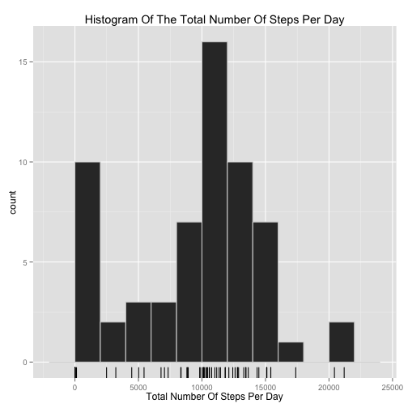
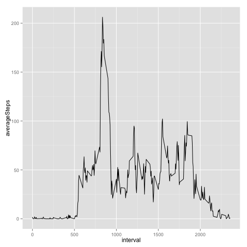
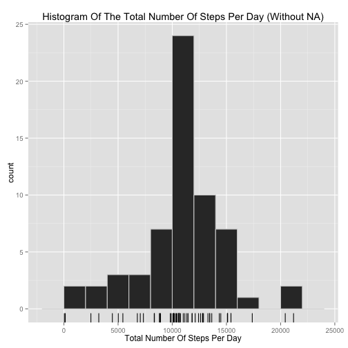

# Reproducible Research: Peer Assessment 1


```r
rm(list = ls())  # clean up environment to reduce side effects
# no need to do anything about echo since the default is TRUE
library(lubridate)
library(data.table)
```

```
## 
## Attaching package: 'data.table'
## 
## The following objects are masked from 'package:lubridate':
## 
##     hour, mday, month, quarter, wday, week, yday, year
```

```r
library(ggplot2)
```


## Loading and preprocessing the data

```r
zipfile <- "activity.zip"
activityFileName <- "activity.csv"

activities <- read.csv(unz(zipfile, activityFileName))
activities$date <- ymd(activities$date)

convertIntervalToHourMinutes <- function(interval) {
    hoursOnly <- interval%/%100
    minutesOnly <- interval - (hoursOnly * 100)
    
    return(hm(paste(hoursOnly, minutesOnly, sep = ":")))
}

dateTimeInterval <- activities$date + convertIntervalToHourMinutes(activities$interval)
activities <- cbind(activities, dateTimeInterval)
summary(activities)
```

```
##      steps            date               interval   
##  Min.   :  0.0   Min.   :2012-10-01   Min.   :   0  
##  1st Qu.:  0.0   1st Qu.:2012-10-16   1st Qu.: 589  
##  Median :  0.0   Median :2012-10-31   Median :1178  
##  Mean   : 37.4   Mean   :2012-10-31   Mean   :1178  
##  3rd Qu.: 12.0   3rd Qu.:2012-11-15   3rd Qu.:1766  
##  Max.   :806.0   Max.   :2012-11-30   Max.   :2355  
##  NA's   :2304                                       
##  dateTimeInterval             
##  Min.   :2012-10-01 00:00:00  
##  1st Qu.:2012-10-16 05:58:45  
##  Median :2012-10-31 11:57:30  
##  Mean   :2012-10-31 11:57:30  
##  3rd Qu.:2012-11-15 17:56:15  
##  Max.   :2012-11-30 23:55:00  
## 
```

```r

activities.dt <- as.data.table(activities)
```


## What is mean total number of steps taken per day?

```r

totalStepsPerDay <- activities.dt[, list(totalSteps = sum(steps, na.rm = TRUE)), 
    by = date]

# TODO: add title and proper axis titles maybe convert totals to table?
g <- ggplot(totalStepsPerDay, aes(x = totalSteps))
g <- g + geom_histogram(binwidth = 2000)
g + geom_rug()
```

 

```r

# mean and median total steps per day
totals <- totalStepsPerDay[, list(mean = mean(totalSteps), median = median(totalSteps))]
```


- The mean step per day is **9354.2295**
- The median step per day is **10395**

## What is the average daily activity pattern?


```r

avgStepsPerInterval <- activities.dt[, list(averageSteps = mean(steps, na.rm = TRUE)), 
    by = interval]

g <- ggplot(avgStepsPerInterval, aes(interval, averageSteps))
g + geom_line()
```

 

```r


# interval with the maximum average number of steps
maxAverageNumberOfSteps <- max(avgStepsPerInterval$averageSteps)
result <- avgStepsPerInterval[averageSteps == maxAverageNumberOfSteps, interval]
```

- The interval with the biggest average number of step is **835**


## Imputing missing values
The number of missing steps in the dataset is : **2304**

### Filling missing values
Strategy being used:
Take the mean step of each interval to replace the missing values.

```r
nomissing.dt <- activities.dt
nomissing.dt[is.na(steps), `:=`(steps, round(avgStepsPerInterval[avgStepsPerInterval$interval == 
    interval, averageSteps]))]
```

```
## Warning: Coerced 'double' RHS to 'integer' to match the column's type; may
## have truncated precision. Either change the target column to 'double'
## first (by creating a new 'double' vector length 17568 (nrows of entire
## table) and assign that; i.e. 'replace' column), or coerce RHS to 'integer'
## (e.g. 1L, NA_[real|integer]_, as.*, etc) to make your intent clear and for
## speed. Or, set the column type correctly up front when you create the
## table and stick to it, please.
```

```
##        steps       date interval    dateTimeInterval
##     1:     2 2012-10-01        0 2012-10-01 00:00:00
##     2:     0 2012-10-01        5 2012-10-01 00:05:00
##     3:     0 2012-10-01       10 2012-10-01 00:10:00
##     4:     0 2012-10-01       15 2012-10-01 00:15:00
##     5:     0 2012-10-01       20 2012-10-01 00:20:00
##    ---                                              
## 17564:     5 2012-11-30     2335 2012-11-30 23:35:00
## 17565:     3 2012-11-30     2340 2012-11-30 23:40:00
## 17566:     1 2012-11-30     2345 2012-11-30 23:45:00
## 17567:     0 2012-11-30     2350 2012-11-30 23:50:00
## 17568:     1 2012-11-30     2355 2012-11-30 23:55:00
```


```r

totalStepsPerDay.noNA <- nomissing.dt[, list(totalSteps = sum(steps, na.rm = TRUE)), 
    by = date]

# TODO: add title and proper axis titles maybe convert totals to table?
g <- ggplot(totalStepsPerDay.noNA, aes(x = totalSteps))
g <- g + geom_histogram(bidwidth = 2000)
g + geom_rug()
```

```
## stat_bin: binwidth defaulted to range/30. Use 'binwidth = x' to adjust this.
```

 

```r

# mean and median total steps per day
totals.noNA <- totalStepsPerDay.noNA[, list(mean = mean(totalSteps), median = median(totalSteps))]
```


- The mean step per day without NA is 1.0766 &times; 10<sup>4</sup>
- The median step per day without NA is 10762

## Are there differences in activity patterns between weekdays and weekends?


